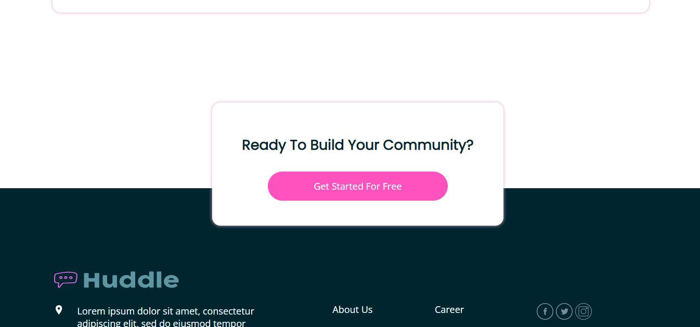

# Frontend Mentor - Huddle landing page with alternating feature blocks solution

This is a solution to the [Huddle landing page with alternating feature blocks challenge on Frontend Mentor](https://www.frontendmentor.io/challenges/huddle-landing-page-with-alternating-feature-blocks-5ca5f5981e82137ec91a5100). Frontend Mentor challenges help you improve your coding skills by building realistic projects. 

## Table of contents

- [Overview](#overview)
  - [The challenge](#the-challenge)
  - [Screenshot](#screenshot)
- [My process](#my-process)
  - [Built with](#built-with)
  - [Continued development](#continued-development)
- [Author](#author)

## Overview

### The challenge

Users should be able to:

- View the optimal layout depending on their device's screen size
- See hover and focus states for interactive elements

### Screenshot

### Links

- Live Site URL: [huddle-landing-page-challenge](https://1f18bcab.huddle-landing-page-challenge.pages.dev/)

## My process

### Built with

- Semantic HTML5 markup
- CSS custom properties
- CSS Grid

### Continued development

After this challenge, I want to upgrade my skill to learn JS and React!!

## Author

- Frontend Mentor - [@zulfaan](https://www.frontendmentor.io/profile/zulfaan)
- Twitter - [@zulfaan](https://www.twitter.com/longlive1984)
